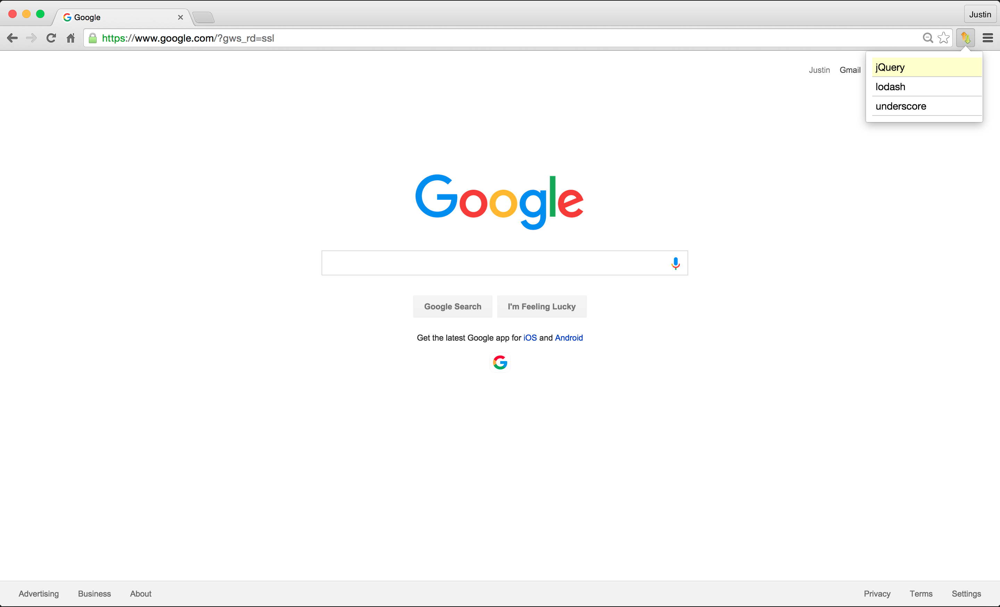
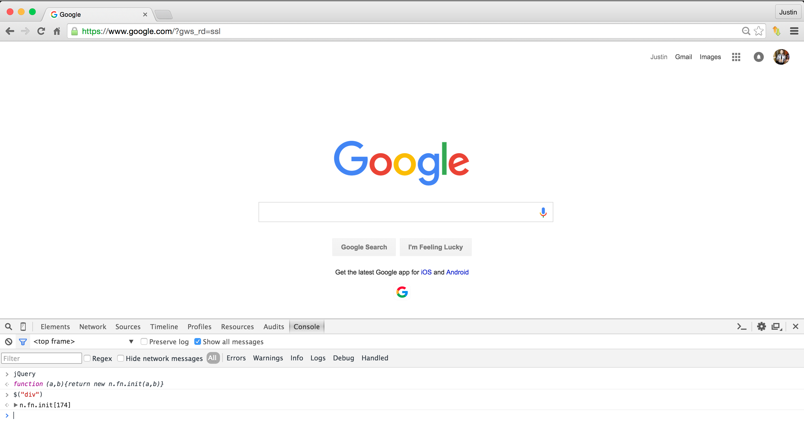

# ConsoleTap
Quickly Load JavaScript Libraries Into Your Browser  
  
#### Steps  
1. Click the ConsoleTap icon  
2. Select your desired JavaScript file  
  
  
BAM!  It's loaded into your browser!  
  
###### Would you just look at that! Seriously.. just look at it!  

